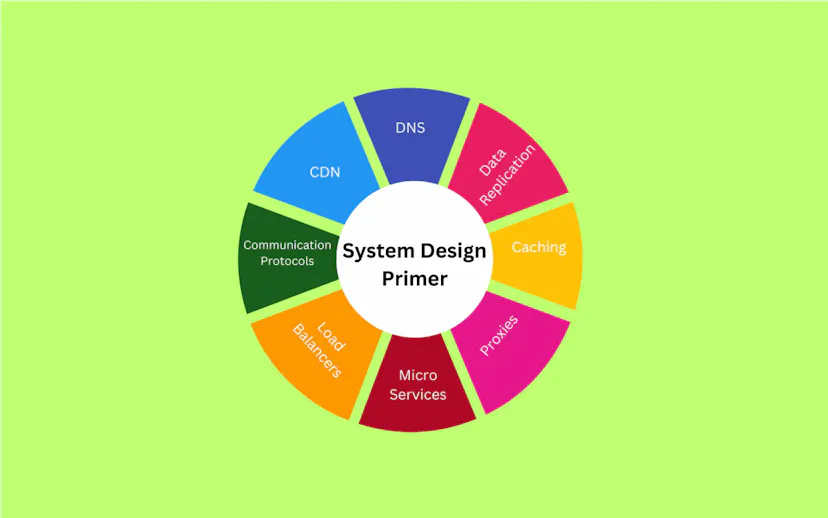

# **System Design Primer: The Ultimate Guide** 
 
# Understanding System Design  
***System design is a step-by-step process of defining a particular software's architecture, modules and components***  
#### Importance of the Concept 
<ol>
<li>Vital in building scalable and reliable software.
<li>Helps tech giant companies like Google, Microsoft and Amazon to  check the interviewer's ability to think about building the application's architecture from scratch. 
<li>System design primer helps you to understand the essence of system design and various concepts from basic to advanced.  

#### Steps of Software Development  
<ol>
<li>Identify the requirements:  
- can be functional and non-functional.Non-functional requirements include scalability, high availability and consistency 
<li>System design- Prepare the architecture for the application according to requirements.It includes deciding whether  to use SQL or NoSQL databases based on the data you need to store.
<li>Decide how to make the application scalable in case the traffic increases. You can have multiple servers worldwide and serve the resources to users from the nearest server to make their applications efficient.

#### ***System Design Methods*** 
Developers should choose a particular method based on the project's requirements. 

***1. Architectural Design*** 

- Being the base of the system design, it describes the infrastructure, model, view, components and interaction.  
 - It includes client-server interaction and microservices.
 
 ***2. ERD Diagram(Entity-relationship diagram)***  

 Its uses include:  
 - In designing the application's database structure.
 - Used to define multiple database schemas 
 - Used to add entities in each schema 
 - Used to add multiple attributes for each entity
 - Used to connect the entities of two different schemas if a relationship exists between them. 

 ***3. UML Diagram(Unified modeling language)***  
 - It contains different diagrams like activity diagrams, class diagrams and sequence diagrams to represent the different aspects of the system.
 - Used to prepare modeling software systems.  

 ***4.Class Diagrams***
-  Used to represent the classes and  provides an overview of the system's data and functionality.
- They can contain the class's attributes, methods and relationships between multiple classes.

***5. Sequence Diagrams***
- Represent the interaction between the various components of the system. 
- Used to model the behavior of the system.
### System Design Concepts
#### 1. Performance vs Scalability  
- ***Performance***

-Involves evaluation of the time a website takes to load. 
-Disadvantage of poor performance-Traffic can decrease as visitors prefer to go to other websites.  
-Mechanisms to increase the application's performance and serve resources faster  include caching. 

- ***Scalability***
-It is the ability to scale the application.  
-Scaling techniques: 
(a)By distributing the load across multiple servers  
(b) Increasing the single server's capacity.  
(c)By developing a new server.

#### 2. Latency vs Throughput
***Latency***  
-Measurement of the time delay to complete a single request or data operation.  
-It is a network delay that occurs due to Geographical distance, transport protocol, or network infrastructure and ***measured  in Milliseconds.***  
-Uses:  
(a)Online or live gaming  
(b)Live streaming  
(c)Video calls  

***Throughput***  
-It is the number of operations the system can handle in a particular time or the number of data passed via network request in a given time. 
-***It is measured in megabytes (MB) per second.***
-Used to check the capability of the systems. If the throughput of the server is low, architectures can scale the server to make it efficient.

#### .3. Consistency Patterns and Availability Patterns
***Consistency***  
In the case of a banking system,if consistent,it will subtract the withdrawn balance only once from the total balance.

***Availability***  
 The system's availability ensures that each request receives a response either with fresh or old data. The availability is important when high uptime is needed.
#### Consistency Patterns
<ol>
<li>Strong consistency:  

- Ensures that each request gets the most recent data.
 To achieve strong consistency, you require synchronized communication. It prioritizes consistency over availability.  
 <li>Eventual Consistency  
 
 - Allows temporary inconsistencies to be resolved soon. It prioritizes availability over consistency.
 <li> Weak Consistency
 
 - Here,the user may get fresh data after writing the data.
 - It focuses on the fast access and can be used in live streaming or video chat.
 #### Availability Patterns
 <ol>
 <li>Load Balancing  
 
 - The upcoming request can be distributed across multiple servers to achieve high availability.
 - As we balance the load here, it is called the load balancing.
 <li>Retry and timeout strategies

 - Importance-to process the request after every interval if the system fails or if not available.
 ## Advanced Concepts in System Design
#### 1. CDN(Content delivery network)
-Is a distributed server network located at different geo-locations.  
uses:
- To deliver content like images, various data, etc., from the server.
-The CDN delivers the resource faster, decreases latency (network delay), and improves the application's performance.

### 2. DNS(Domain name system)
- Allows users to access the website and its resources using the domain name (e.g., www.example.com) and maps the unique domain name with a unique IP address. So, whenever you make a request for the resources of the particular domain name, it returns the resources of IP addresses, which are mapped with the domain name.

### 3. Caching

- Also called high-speed storage.  
- It is a mechanism to serve resources faster  between the web application and the source of the data.
-Its working- it requests the database or source of the data, stores it in the cache storage, and sends data to the application.

### 4. Proxies  

 
- Also called the proxy server which   works between the client of the application and the internet.
 - Whenever you request to get resources from the internet, the application requests the proxy server, and the proxy server gets resources and sends them back to the application.

The proxy servers are used for the caching.

#### Components of System Design
***1.Microservices and Service Discovery***
- They break down complex applications into small services, such that each service works independently and accomplishes specific tasks.
**Concepts  related to the microservices.**

***1. Microservices and Service Discovery***

***a.Service Identification:***
-Every microservice has a unique ID and name for its identification.  
***b.Dynamic Service Discovery***  
-Each microservice can dynamically find other services located in the same network. 

***2. Database Systems: RDBMS and NoSQL***

***(a)RDBMS( Relational database management system.)***  
-It makes it easier to access the data from the database and connect it with other data as they are stored in the table format.   

 ***Characteristics***  
 1.It stores the data in the table format.  
2.You can’t scale the RDBMS database horizontally, but you can scale it vertically.  
3.SQL is a query language for the RDBMS databases.  
4.Accessing data from the RDBMS database is slow.  
***(b)NoSQL(Non-SQL database. )***
 - It stores the data in the key-value pair instead of in table format.   
 - Use the NoSQL database when you are required to store unstructured data in the database.
 ***characteristics***  
1.Stores the data in the key-value pair format  
2.It is horizontally scalable, as you can add new key-value pairs for new attributes.  
3.Each record can contain different key-value pairs.  
4.It is faster than RDBMS databases.  
5.It supports frequent changes in the database.

***3.Communication Protocols***
- Protocols mean **rules**
- communication protocols refer to **the rules to communicate or exchange the data between two systems.**

*communication protocols*
**1.HTTP/HTTPS(hypertext transfer protocol)**  
-A secure version of HTTP, used in web-based communication. 

**2.TCP/IP( transmission control protocol).** 
 - Used to communicate over the internet. 
 - It is mainly used for live streaming and video calls
 - Data loss can be tolerable.

**3.WebSockets**
The web sockets are used for bi-directional duplex communication and builds the connection between two web applications.

***Approaching System Design Interview Questions***
1. Requirements clarification
2. Estimation of resources
3. System interface definition
4. Defining Data model
5. High-level design
6. Detailed design
7. Identifying and resolving bottlenecks

### Sample System Design Interview Questions and Solutions ###

**1. How would you design a URL Shortening service similar to TinyURL?**
Requirements clarification:

- When you give a long URL as an input, it should return the shortened URL.
- When you click the shortened URL, it should redirect to the original URL.
- Consider 500 requests per second, and make scalable accordingly.
- Delete the expired URLs.
- Track the number of clicks on the URL.
Approach:

You can discuss the below stuff.

- How you will use the REST API to communicate with the server.
- How will you handle the 500 requests every second via load balancing?
- You can discuss using the relational database, as it doesn’t require horizontal scaling.
- You can discuss how you will prepare a table for relational database to map long URLs with short URLs.
- The critical point is how to shorten the long URL by providing a unique id to each shortened URL.
***2. How would you design a Web Crawler?***
- Discuss how you open multiple web pages in the web browser. 
- Know how many browser windows you will open simultaneously to crawl multiple web pages.  
***3. How would you design Facebook and Instagram?***
Requirements:
- User signup/sign-in
- Allowing users to publish posts and short videos
Followers and following features
- Direct messaging
- Showing the latest posts from their followers
- Showing trending posts in the feed

Approach:

- Talk about how you will handle the relationship between users in the database.
- Talk about how you will implement the chat features. 
- Talk about integrating third-party chatting applications.

